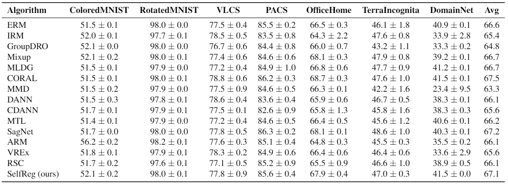

# SelfReg: Self-supervised Contrastive Regularization for Domain Generalization
PyTorch official implementation of (Daehee Kim, Youngjun Yoo, Seunghyun Park, Jinkyu Kim, and Jaekoo Lee. "SelfReg: Self-supervised Contrastive Regularization for Domain Generalization." ICCV, 2021). - [arxiv version](https://arxiv.org/abs/2104.09841)

## Description

An overview of our proposed SelfReg. Here, we propose to use the self-supervised (in-batch) contrastive losses to regularize the model to learn domain-invariant representations. These losses regularize the model to map the representations of the "same-class" samples close together in the embedding space. We compute the following two dissimilarities in the embedding space: (i) individualized and (ii) heterogeneous self-supervised dissimilarity losses. We further use the stochastic weight average (SWA) technique and the inter-domain curriculum learning (IDCL) to optimize gradients in conflict directions.

Visualizations by t-SNE for (a) baseline (no DG techniques), (b) [RSC](https://arxiv.org/abs/2007.02454), and (c) ours. For better understanding, we also provide sample images of house from all target domains. Note that we differently color-coded each points according to its class. (Data: [PACS](https://domaingeneralization.github.io/#data))

## Computational Efficiency of IDCL (Inter-domain Curriculum Learning)
|Backbone| Training Strategy | Training Time(s)|
| :------:| :--------------:| :-----------: |
| ResNet-18 | Baseline (classic training strategy) |1556.8|
| ResNet-18 | IDCL strategy | 1283.5|

We used one V100 GPU for model training.
The training time in above table is the time it took to train all domains independently.
The training time of the IDCL is 1283.5 seconds, equivalent to 82.4% of baseline on PACS.

## Dependency
- python >= 3.6
- pytorch >= 1.7.0
- torchvision >= 0.8.1
- jupyter notebook
- gdown

## How to Use

1. `cd codes/` and `sh download.sh` to download PACS dataset.
2. Open `train.ipynb` and `Run All`.
3. Make sure that the training is running well in the last cell.
4. Check the results stored in path `codes/resnet18/{save_name}/` when the training is completed.

## Test trained SelfReg ResNet18 model
To test a ResNet18, you can download pretrained weights (SelfReg model) with [this link](https://drive.google.com/file/d/1sGamN3DYKGs4laosp23O4DpO-JDE5W0p/view?usp=sharing).

These weights are wrapped  `torch.optim.swa_utils.AveragedModel()` (SWA implementation of PyTorch).
| Backbone        | Target Domain |Acc %            
| :--------------:| :-----------: | :------------:  
| ResNet-18       |Photo          |96.83            
| ResNet-18       |Art Painting         |83.15            
| ResNet-18       |Cartoon        |79.61            
| ResNet-18       |Sketch            |78.90           

## Benchmark of SelfReg in [DomainBed](https://github.com/facebookresearch/DomainBed)

